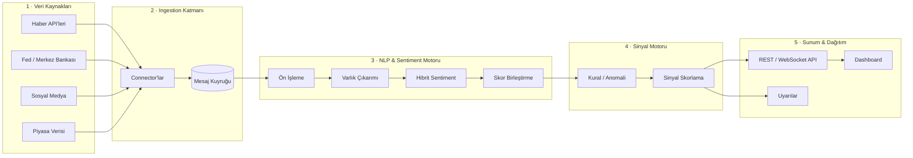
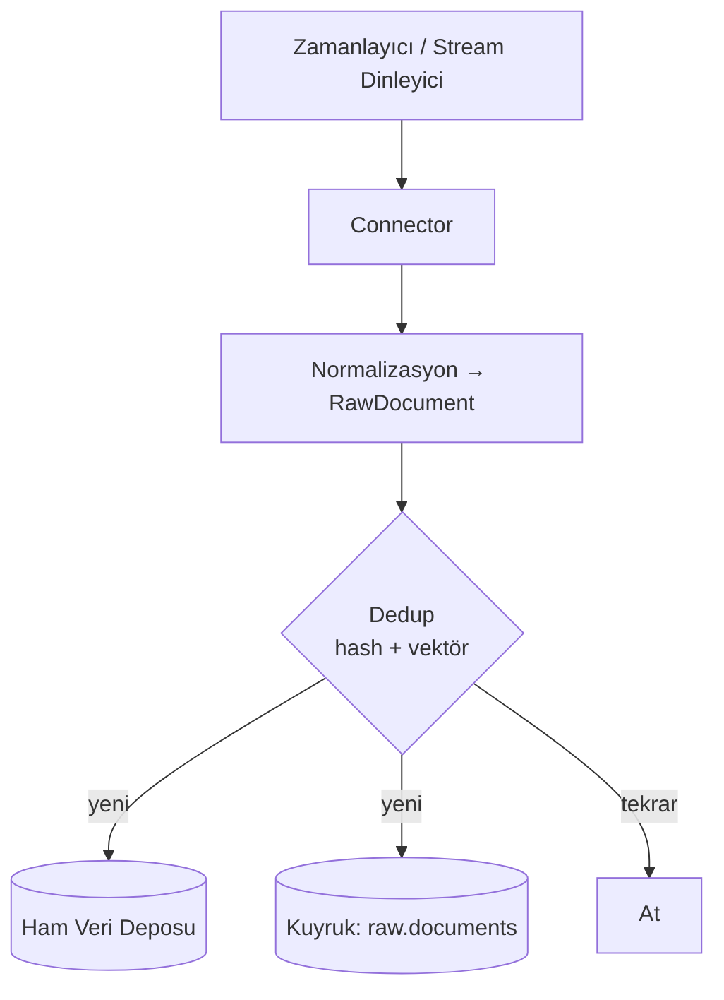
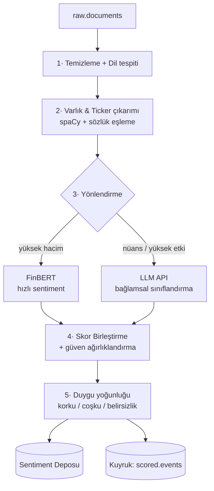
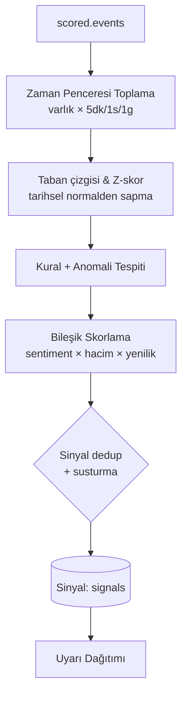

# Macro-Sentiment Agent — Mimari Planı

> Finansal haberleri, merkez bankası (Fed) kararlarını ve sosyal medyayı API'ler üzerinden okuyan; NLP ile metinleri analiz edip piyasa duyarlılığı (sentiment) sinyalleri üreten otonom ajan sistemi.

**Versiyon:** 1.0
**Tarih:** 2026-06-29
**Durum:** Mimari Taslak

---

## 1. Amaç ve Kapsam

### 1.1 Problem
Piyasayı hareket ettiren bilgi, fiyat verisinden önce metin olarak ortaya çıkar: haber başlıkları, Fed/ECB toplantı tutanakları, şirket açıklamaları, X (Twitter)/Reddit akışları. İnsan bu akışı gerçek zamanlı takip edemez. Amaç, bu metin akışını sürekli okuyup **işlenebilir duyarlılık sinyalleri** üreten bir sistem kurmak.

### 1.2 Sistemin ürettiği çıktı
Sistem ham veriyi şu tip sinyallere dönüştürür:

- `"BTC — Aşırı korku: son 1 saatte negatif haber yoğunluğu %300 arttı, panik satışı riski."`
- `"SPX — Fed 'hawkish' tonu yükseliyor; tutanak duyarlılığı -0.62 (önceki -0.18)."`
- `"NVDA — Sosyal medya coşkusu zirvede (euphoria); olası tepe/geri çekilme sinyali."`

Her sinyal; **yön (olumlu/olumsuz/nötr), şiddet (0–100), güven skoru, kaynak dağılımı ve zaman damgası** içerir.

### 1.3 Kapsam dışı (v1)
- Otomatik emir gönderme / işlem yürütme (sistem **karar destek** üretir, işlem yapmaz).
- Fiyat tahmini (forecasting) modeli — v2'ye bırakılır.
- Yatırım tavsiyesi. Çıktılar bilgilendirme amaçlıdır.

---

## 2. Mimari Genel Bakış

Sistem **event-driven (olay güdümlü)** ve **mikroservis** yaklaşımıyla, yatay ölçeklenebilir 5 ana katmandan oluşur:



### 2.1 Tasarım ilkeleri
- **Gevşek bağlılık:** Her katman mesaj kuyruğu ile haberleşir; bir kaynak çökse sistem ayakta kalır.
- **Idempotent işleme:** Aynı haber iki kez gelse tek kez işlenir (deduplication / hash).
- **Geri-doldurma (backfill) yeteneği:** Ham veri saklanır; modeller iyileştikçe geçmiş yeniden işlenebilir.
- **İnsan döngüde (human-in-the-loop):** Yüksek etkili sinyaller işaretlenir, geri bildirim modeli eğitir.

---

## 3. Teknoloji Yığını Önerisi

> Stack seçimi sana bırakıldı; aşağıdaki **dengeli (hibrit bulut)** öneri, hız ile maliyet kontrolünü birlikte gözetir. Tek sunucuda MVP'den buluta ölçeklenebilir.

| Katman | Önerilen | Neden |
|---|---|---|
| Dil / Runtime | **Python 3.12** + asyncio | NLP/ML ekosistemi, async I/O ile yüksek throughput |
| API Servisi | **FastAPI** + Uvicorn | Async, otomatik OpenAPI, WebSocket desteği |
| Mesaj Kuyruğu | **Redis Streams** (MVP) → **Kafka** (ölçek) | Düşük gecikme; Kafka'ya geçiş yolu açık |
| Görev Orkestrasyonu | **Celery / Arq** veya **Prefect** | Zamanlanmış toplama + asenkron işleme |
| Vektör DB | **Qdrant** / pgvector | Semantik dedup, benzer haber kümeleme |
| Ana Veritabanı | **PostgreSQL** (+ TimescaleDB) | Zaman serisi sinyaller + ilişkisel meta |
| Önbellek | **Redis** | Rate-limit, dedup, sıcak veriler |
| NLP — yerel | **FinBERT**, spaCy, HuggingFace Transformers | Finans-özel duyarlılık, varlık çıkarımı |
| NLP — LLM | **Claude / GPT API** | Nüans, bağlam, sıfır-shot sınıflandırma |
| Gözlemlenebilirlik | Prometheus + Grafana, OpenTelemetry, Sentry | Metrik, iz, hata takibi |
| Konteyner / Dağıtım | Docker + (K8s veya ECS/Cloud Run) | Yatay ölçek, izolasyon |
| Gizli Anahtar Yönetimi | Vault / cloud secret manager | API key güvenliği |

**Maliyet modu:** MVP tek bir VM'de (Docker Compose: FastAPI + Postgres + Redis + worker) çalışır. Hacim arttıkça kuyruk Kafka'ya, worker'lar K8s'e taşınır.

---

## 4. Katman 1 — Veri Kaynakları

### 4.1 Finansal haber
| Kaynak | Erişim | Not |
|---|---|---|
| NewsAPI / GDELT | REST | Geniş başlık taraması, ucuz |
| Benzinga / Marketaux | REST | Ticker bazlı, düşük gecikme |
| RSS akışları (Reuters, Bloomberg vb.) | RSS/Atom | Tamamlayıcı, ücretsiz |

### 4.2 Merkez bankası / Fed
| Kaynak | Erişim | Not |
|---|---|---|
| FRED API (St. Louis Fed) | REST | Makro seriler, takvim |
| Fed press releases / FOMC tutanakları | Web/RSS | Tutanak metni → "hawkish/dovish" skoru |
| ECB, TCMB vb. | REST/Web | Çoklu merkez bankası genişletmesi |

> **Önemli analiz:** Fed tutanakları için "hawkish–dovish" ekseninde özel bir sözlük + LLM sınıflandırması kullanılır. Tek bir kelime ("patient", "transitory") tonu değiştirebilir.

### 4.3 Sosyal medya
| Kaynak | Erişim | Not |
|---|---|---|
| X (Twitter) API v2 | REST/Stream | Filtreli akış; bot/spam temizliği şart |
| Reddit (r/wallstreetbets, r/stocks) | PRAW API | Perakende yatırımcı duyarlılığı |
| StockTwits | REST | Doğal "bullish/bearish" etiketleri |

### 4.4 Piyasa verisi (bağlam için)
Sinyali fiyat hareketiyle ilişkilendirmek için: **yfinance / Polygon / Binance API**. Duyarlılık tek başına değil, fiyat bağlamıyla birlikte değer kazanır.

### 4.5 Connector standardı
Her kaynak ortak bir arayüz uygular:

```python
class SourceConnector(Protocol):
    async def fetch(self, since: datetime) -> list[RawDocument]: ...
    def rate_limit(self) -> RateLimitPolicy: ...
    source_id: str
```

Yeni kaynak eklemek = yeni bir connector yazmak. Çekirdek değişmez.

---

## 5. Katman 2 — Ingestion (Veri Toplama)



Sorumluluklar:
- **Çekme stratejisi:** Stream destekleyen kaynaklar (X) için sürekli dinleme; diğerleri için polling (örn. her 30–60 sn).
- **Rate-limit yönetimi:** Token-bucket; kaynak başına kota, exponential backoff.
- **Normalizasyon:** Her belge ortak şemaya (`RawDocument`) dönüştürülür: `id, source, url, title, body, published_at, lang, raw_meta`.
- **Deduplikasyon:** İçerik hash'i (tam tekrar) + vektör benzerliği (aynı haberin farklı kaynaklardaki kopyaları).
- **Ham saklama:** Her belge object storage / Postgres'e ham haliyle yazılır (backfill ve denetim için).

---

## 6. Katman 3 — NLP & Sentiment Motoru (Çekirdek)

Bu, sistemin kalbi. **Hibrit yaklaşım** seçildi: hızlı/ucuz yerel modeller geniş hacmi tarar, LLM yalnızca nüans gerektiren veya yüksek etkili metinlerde devreye girer.



### 6.1 Aşamalar

**1) Ön işleme:** HTML/emoji/URL temizliği, dil tespiti, gerekirse çeviri, cümle segmentasyonu. Spam/bot filtreleme (özellikle sosyal medya).

**2) Varlık çıkarımı (NER):** Hangi varlık konuşuluyor? Şirket adı → ticker eşleme (örn. "Apple" → AAPL), sektör, varlık sınıfı (hisse/kripto/emtia/FX). spaCy + özel finans sözlüğü + fuzzy matching.

**3) Yönlendirme (routing):** Maliyet kontrolünün anahtarı. Sıradan başlıklar yerel FinBERT'e; uzun/karmaşık/yüksek-etkili metinler (Fed tutanağı, kazanç çağrısı) LLM'e gider.

**4) Hibrit sentiment:**
- **Yerel — FinBERT:** Finans diline eğitilmiş; her belge için `{positive, negative, neutral}` olasılığı. Düşük maliyet, milisaniye gecikme.
- **LLM katmanı:** Yapılandırılmış prompt ile yön + şiddet + gerekçe + "hawkish/dovish" ekseni döner. Few-shot örneklerle finans bağlamına sabitlenir.
- **Aspect-based:** Tek metinde birden çok varlık olabilir; duyarlılık varlık başına ayrıştırılır.

**5) Duygu yoğunluğu modellemesi:** Sadece +/− değil; **korku (fear), coşku (euphoria/greed), belirsizlik (uncertainty)** boyutları. Bu, "panik satışı" gibi sinyallerin temeli. Fear & Greed benzeri bir bileşik endeks üretir.

### 6.2 Skor şeması (varlık × zaman)
```json
{
  "entity": "BTC",
  "window": "2026-06-29T13:00Z/PT1H",
  "polarity": -0.71,
  "intensity": 88,
  "emotion": { "fear": 0.82, "greed": 0.05, "uncertainty": 0.41 },
  "volume": 1240,
  "confidence": 0.79,
  "source_breakdown": { "news": -0.6, "social": -0.85, "fed": null }
}
```

### 6.3 Doğruluk güvenceleri
- **İnsan etiketli kalibrasyon seti:** Model çıktıları periyodik olarak insan etiketleriyle kıyaslanır.
- **Model versiyonlama:** Her skor, üreten model versiyonunu taşır (denetlenebilirlik).
- **Sarkasm/ironi:** Sosyal medyada yaygın; LLM katmanı + güven skoru düşürme ile yönetilir.

---

## 7. Katman 4 — Sinyal Motoru

Skorlanmış olaylar tek başına gürültülüdür. Sinyal motoru bunları **anlamlı, az sayıda, eyleme dönük** uyarıya damıtır.



### 7.1 Sinyal mantığı
- **Taban çizgisinden sapma:** "Negatif haber yoğunluğu, 30 günlük ortalamanın 3 standart sapma üzerinde." Mutlak değer değil, **anomali** sinyal üretir.
- **Hacim × duyarlılık:** Yüksek hacim + güçlü negatif = güçlü sinyal. Düşük hacimde aynı duyarlılık zayıf.
- **Hız (velocity):** Duyarlılığın değişim hızı çoğu zaman seviyesinden daha önemlidir.
- **Çok kaynaklı teyit:** Hem haberde hem sosyalde aynı yön → güven artar.
- **Susturma (cooldown):** Aynı sinyal tekrar tekrar atılmaz; eşik geçişlerinde tetiklenir.

### 7.2 Sinyal tipleri
| Tip | Tetikleyici | Örnek çıktı |
|---|---|---|
| Panik / Korku | Negatif + yüksek korku + hacim patlaması | "Aşırı korku — panik satışı riski" |
| Coşku / Tepe | Aşırı pozitif + greed zirvesi | "Euphoria — olası tepe/geri çekilme" |
| Fed tonu | Tutanak hawkish/dovish kayması | "Hawkish ton güçleniyor" |
| Anlatı değişimi | Konu/temada ani sapma | "NVDA anlatısı negatife döndü" |
| Sessizlik kırılması | Uzun nötr sonrası ani aktivite | "Olağandışı haber aktivitesi" |

> Sinyaller **olasılıksal**dır ve geçmiş veriyle geriye-test (backtest) edilerek kalibre edilmelidir. Sistem tavsiye değil, erken uyarı üretir.

---

## 8. Katman 5 — Sunum & Dağıtım

- **REST API (FastAPI):** Sorgu — `GET /signals?entity=BTC&since=...`, skor geçmişi, kaynak detayları.
- **WebSocket / SSE:** Gerçek zamanlı sinyal akışı (dashboard ve botlar için push).
- **Uyarı kanalları:** Slack, Telegram, e-posta, webhook. Her sinyal şiddete göre kanal seçer.
- **Dashboard:** Varlık bazlı duyarlılık zaman serisi, Fear & Greed göstergesi, aktif sinyaller, kaynak dağılımı, fiyat overlay.

---

## 9. Veri Modeli (özet)

```
raw_documents     (id, source, url, title, body, published_at, lang, hash, raw_meta)
entities          (id, name, ticker, asset_class, aliases[])
sentiment_scores  (id, doc_id, entity_id, polarity, intensity, emotion_json,
                   confidence, model_version, created_at)
signals           (id, entity_id, type, severity, window, payload_json,
                   created_at, acknowledged)
feedback          (id, signal_id, user_label, note, created_at)   -- HITL
```

Zaman serisi tablolar (`sentiment_scores`, `signals`) TimescaleDB hypertable olarak — verimli pencere sorguları için.

---

## 10. Çapraz Kesen Konular

### 10.1 Gözlemlenebilirlik
- **Metrikler:** Kaynak başına çekme gecikmesi, kuyruk derinliği, model çıkarım süresi, LLM token maliyeti, sinyal/dk.
- **İzleme:** OpenTelemetry ile uçtan uca iz (belge → sinyal).
- **Veri kalitesi:** Kaynak susarsa / şema bozulursa alarm.

### 10.2 Güvenilirlik
- Kaynak başına izolasyon (biri çökse diğerleri çalışır).
- Kuyruk + idempotency ile en-az-bir-kez işleme.
- Ölü mektup kuyruğu (dead-letter) başarısız belgeler için.

### 10.3 Maliyet kontrolü
- LLM yönlendirmesi (yalnızca gerekli metinlerde) en büyük tasarruf kalemi.
- Yerel modellerin batch çıkarımı; sonuç önbellekleme.
- Kademeli işleme: önce ucuz filtre, sonra pahalı model.

### 10.4 Uyumluluk ve etik
- API kullanım koşullarına (özellikle X/Reddit) uyum.
- **Yatırım tavsiyesi değildir** ibaresi her çıktıda.
- Kişisel veri toplanmaz; yalnızca kamuya açık metin.
- Piyasa manipülasyonuna alet edilmeyecek tasarım (sinyal üretir, işlem yapmaz).

### 10.5 Güvenlik
- API anahtarları secret manager'da, koda gömülmez.
- API kimlik doğrulama (API key / OAuth), rate-limit.
- En az yetki ilkesi servisler arası erişimde.

---

## 11. Yol Haritası (aşamalı kurulum)

| Faze | Kapsam | Çıktı |
|---|---|---|
| **Faz 0 — MVP** | 1 haber kaynağı + FinBERT + basit kural + REST API, tek VM/Docker Compose | Tek varlık için duyarlılık skoru |
| **Faz 1** | Çoklu kaynak (haber+sosyal+Fed), dedup, hibrit LLM, dashboard | Çok kaynaklı sinyaller + uyarılar |
| **Faz 2** | Anomali tespiti, taban çizgisi, backtest, HITL geri bildirim | Kalibre edilmiş, güvenilir sinyaller |
| **Faz 3** | Kafka + K8s ölçekleme, çoklu merkez bankası, fiyat korelasyonu | Üretim ölçeği, kurumsal kullanım |

---

## 12. Başlıca Riskler

| Risk | Etki | Azaltma |
|---|---|---|
| API kota/maliyet patlaması | Yüksek | Yönlendirme, önbellek, kademeli işleme |
| Sosyal medya gürültü/bot/sarkazm | Orta | Bot filtresi, güven düşürme, LLM teyidi |
| Yanlış pozitif sinyal | Yüksek | Backtest, anomali tabanlı eşik, HITL |
| Kaynak API değişimi/kesintisi | Orta | Connector soyutlaması, çoklu kaynak yedeği |
| Aşırı uyum / overfitting | Orta | Versiyonlama, ayrık test seti, düzenli kalibrasyon |

---

*Bu doküman mimari taslaktır; uygulamaya geçmeden önce kaynak API maliyetleri ve sinyal stratejisi backtest ile doğrulanmalıdır. Üretilen sinyaller yatırım tavsiyesi değildir.*
