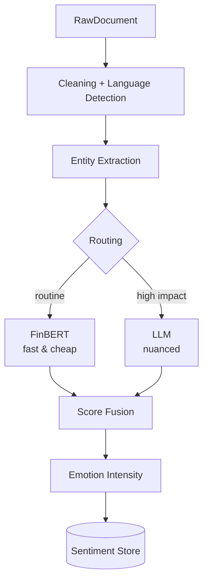
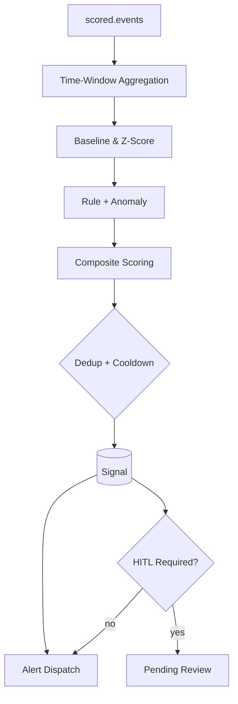
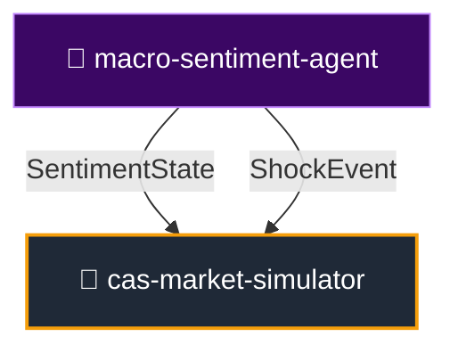

<div align="center">

# 📊 Macro-Sentiment Agent

### Financial news · Fed · social media → NLP → **market sentiment signals**

An autonomous analysis agent that reads text streams in real time and produces **actionable sentiment signals**.  
It generates decision support — **it does not trade, and it does not give investment advice.**

<br>

**🌐 Language:** English · [Türkçe](README.md)

<br>

[](https://github.com/7mertyavuz/macro-sentiment-agent/actions/workflows/ci.yml)


</div>

---

> ⚠️ **Research / PoC — not investment advice.**  
> The signals produced are for informational purposes; no automated orders are sent.

---

## 📌 Table of Contents

- [Project Overview](#-project-overview)
- [Why It Matters](#-why-it-matters)
- [Architecture Overview](#-architecture-overview)
- [Key Features](#-key-features)
- [Quick Start](#-quick-start)
- [Module / Layer Guide](#-module--layer-guide)
- [Data Models](#-data-models)
- [NLP Engine](#-nlp-engine)
- [Signal Engine](#-signal-engine)
- [Place in the CAS Ecosystem](#-place-in-the-cas-ecosystem)
- [Deployment](#-deployment)
- [Observability](#-observability)
- [Tests](#-tests)
- [Glossary](#-glossary)
- [Disclaimer and License](#-disclaimer-and-license)

---

## 🎯 Project Overview

The information that moves markets shows up **as text before it shows up in price data**: news headlines, Fed minutes, corporate disclosures, social media feeds. `macro-sentiment-agent` is an autonomous agent system that continuously reads this text stream, analyzes it with natural language processing (NLP), and produces **early-warning signals**.

The system produces signals like:

```text
⚑ [panic   ] BTC — extreme fear: negative news density rose in the last hour
⚑ [euphoria] NVDA — social media euphoria peaking; possible top signal
⚑ [fed_tone] FED — hawkish tone strengthening; sentiment -0.62
```

Every signal carries:

- **Direction** (positive / negative / neutral)
- **Intensity** (0–100)
- **Confidence score** (0–1)
- **Source distribution** (news / social / Fed)
- **Timestamp** (UTC, tz-aware)

---

## 💡 Why It Matters

| Problem | Solution |
|---|---|
| A human can't track thousands of headlines. | Asynchronous, scalable ingestion engine. |
| The same news repeats across different sources. | Deduplication via hash + vector similarity. |
| LLM costs can rise quickly. | Hybrid NLP router: routine text goes to FinBERT, high-impact text goes to the LLM. |
| False-positive signals | Baseline z-score + cooldown + HITL review queue. |
| Production scale | Migration path from in-memory MVP to Redis Streams / Kafka / Postgres. |

---

## 🏗️ Architecture Overview

The system consists of **5 layers** that are event-driven and loosely coupled:

```mermaid
flowchart LR
    subgraph SRC["1 · Sources"]
        N["📰 News / NewsAPI"]
        F["🏛️ Fed / FRED / FOMC"]
        S["💬 StockTwits / X / Reddit"]
    end

    subgraph ING["2 · Ingestion"]
        C["Connectors"]
        D["Dedup"]
        Q["Queue"]
    end

    subgraph NLP["3 · NLP Engine"]
        PRE["Preprocessing"]
        ENT["Entity Extraction"]
        SENT["Hybrid Sentiment"]
        FUSE["Fusion"]
    end

    subgraph SIG["4 · Signal Engine"]
        BASE["Baseline & Z-Score"]
        RULE["Rule / Anomaly"]
        REV["HITL Review"]
    end

    subgraph OUT["5 · Presentation"]
        API["REST / WS API"]
        ALERT["Alerts"]
        CAS["CAS Bridge"]
    end

    SRC --> C --> D --> Q --> PRE --> ENT --> SENT --> FUSE --> BASE --> RULE --> REV --> API
    RULE --> ALERT
    API --> CAS
```



### 🧩 How the Layers Work

| Layer | Role | Input | Output |
|---|---|---|---|
| **1. Sources** | RSS, NewsAPI, Fed, social media connectors | API / RSS streams | `RawDocument` |
| **2. Ingestion** | Normalize, deduplicate, enqueue | `RawDocument` | Queue messages |
| **3. NLP** | Clean, extract entities, produce sentiment scores | `RawDocument` | `SentimentScore` |
| **4. Signal** | Time-window aggregation, anomaly detection, cooldown | list of `SentimentScore` | `Signal` |
| **5. Presentation** | REST/WebSocket API, alerts, CAS bridge | `Signal` | JSON / WebSocket / Alert |

---

## 📦 Key Features

| Feature | Description |
|---|---|
| 🧠 **Hybrid NLP** | FinBERT (local) + LLM (nuance) + lexicon fallback |
| 📡 **Multi-source** | RSS · NewsAPI · Fed · StockTwits; silently skipped when no key |
| 🔗 **CAS bridge** | `SentimentState` + `ShockEvent` contracts |
| 🚨 **Anomaly signals** | Persistent baseline (Welford) + cooldown |
| 👤 **HITL** | High-impact signals wait for approval |
| 🔭 **Observability** | `/metrics`, structured logs, CI, Docker Compose |
| 🧪 **Simulation mode** | Key-free, deterministic offline demo |
| 🐳 **Container support** | Dockerfile + docker-compose.yml (Postgres + Redis) |

---

## ⚡ Quick Start

### 1. Installation

```bash
# Clone the repo
git clone https://github.com/7mertyavuz/macro-sentiment-agent.git
cd macro-sentiment-agent

# Virtual environment (recommended)
python -m venv .venv
source .venv/bin/activate  # Windows: .venv\Scripts\activate

# Developer install
pip install -e ".[dev]"

# For NLP extras (FinBERT + spaCy)
pip install -e ".[nlp]"
```

### 2. Environment Variables

```bash
cp .env.example .env
```

Fill in the values in the `.env` file. No keys are required to run with basic RSS only.

### 3. Running

```bash
# Offline demo — no API keys required
USE_FINBERT=false python -m macro_sentiment.cli demo --sample tests/fixtures/sample_feed.xml

# REST API
uvicorn macro_sentiment.api.main:app --reload

# Worker (process a specific hourly window)
python -m macro_sentiment.cli run --hours 1
```

### 4. Running with Docker

```bash
# Postgres + Redis + API + Worker
export NEWSAPI_KEY=your_key
export FRED_API_KEY=your_key
docker compose up -d

# Health check
curl -sf http://localhost:8000/health
```

---

## 📚 Module / Layer Guide

### `src/macro_sentiment/sources/` — Data Sources

- **`base.py`**: The `SourceConnector` protocol that all connectors implement.
- **`rss_connector.py`**: Fetches RSS/Atom feeds.
- **`newsapi_connector.py`**: NewsAPI integration (key required).
- **`fed_connector.py`**: FRED / FOMC / Fed press releases.
- **`social_connector.py`**: StockTwits / X / Reddit (key required).
- **`registry.py`**: Central hub for registering and disabling sources.

### `src/macro_sentiment/ingestion/` — Data Ingestion

- **`collector.py`**: Polls connectors periodically.
- **`normalizer.py`**: Normalizes each source into the `RawDocument` schema.
- **`dedup.py`**: Eliminates duplicates via content hash + vector similarity.
- **`queue.py`**: In-memory or Redis Streams message queue.

### `src/macro_sentiment/nlp/` — NLP Engine

| Module | Role |
|---|---|
| `preprocess.py` | HTML/emoji/URL cleanup, language detection |
| `ner.py` | Entity and ticker extraction |
| `sentiment_finbert.py` | Local FinBERT sentiment scoring |
| `sentiment_llm.py` | LLM-based nuanced analysis |
| `router.py` | Routes text to FinBERT or the LLM |
| `hybrid.py` | Hybrid model: cost-controlled fusion |
| `fusion.py` | Combines multi-model output |
| `llm_provider.py` | Anthropic / OpenAI provider abstraction |
| `lexicon_fallback.py` | Lexicon-based fallback scoring |
| `spam_filter.py` | Bot and spam filtering |

### `src/macro_sentiment/signals/` — Signal Engine

- **`aggregator.py`**: Combines scores by entity × time window.
- **`baseline.py`**: Persistent rolling baseline via the Welford algorithm.
- **`rules.py`**: Panic, euphoria, Fed tone, narrative-shift rules.
- **`scorer.py`**: Cooldown and signal intensity computation.
- **`engine.py`**: Signal engine orchestration.
- **`review.py`**: HITL review queue logic.
- **`calibration.py`**: Backtest and automatic threshold calibration.

### `src/macro_sentiment/api/` — Presentation Layer

- **`main.py`**: FastAPI application entry point.
- **`routes.py`**: REST endpoints (`/v1/signals`, `/v1/sentiment`, `/v1/cas/*`).
- **`sentiment_feed.py`**: `SentimentFeed` CAS adapter.
- **`cas_transport.py`**: `SentimentState` / `ShockEvent` serialization.
- **`cas_contracts.py`**: CAS data contracts.
- **`websocket.py`**: Real-time signal stream.
- **`dashboard.py`**: Embedded HTML dashboard.
- **`alerts.py`**: Slack / Telegram / webhook alerts.
- **`scenario.py`**: Deterministic shock scenarios.

### `src/macro_sentiment/storage/` — Persistence

- **`db.py`**: Async SQLAlchemy connection management.
- **`orm.py`**: Database table definitions.
- **`repositories.py`**: CRUD operations.

### `src/macro_sentiment/backtest/` — Evaluation

- **`dataset.py`**: Labeled datasets.
- **`harness.py`**: Backtest runner.
- **`metrics.py`**: F1, precision, recall, etc.

### `src/macro_sentiment/observability/` — Observability

- **`logging.py`**: Structured JSON logging.
- **`metrics.py`**: Prometheus metrics.

### `src/macro_sentiment/worker/` — Background Tasks

- **`tasks.py`**: Scheduled ingestion and processing tasks.

---

## 🧾 Data Models

The system uses standard Pydantic models across layers:

### `RawDocument`

A normalized raw text document pulled from a source.

| Field | Description |
|---|---|
| `id` | Unique identifier within the source |
| `source` | Connector source_id |
| `source_type` | NEWS / FED / SOCIAL / MARKET |
| `title` | Title (if any) |
| `body` | Text content |
| `published_at` | Publication time |
| `content_hash` | Content hash for dedup |

### `SentimentScore`

A sentiment score for a document + entity pair.

| Field | Range | Meaning |
|---|---|---|
| `polarity` | `[-1, 1]` | Overall sentiment |
| `intensity` | `[0, 100]` | Emotion intensity |
| `emotion.fear` | `[0, 1]` | Fear intensity |
| `emotion.greed` | `[0, 1]` | Greed / euphoria intensity |
| `emotion.uncertainty` | `[0, 1]` | Uncertainty intensity |
| `confidence` | `[0, 1]` | Model confidence |
| `source_type` | enum | Which source type it came from |

### `Signal`

The actionable alert produced by the signal engine.

| Field | Description |
|---|---|
| `type` | panic / euphoria / fed_tone / narrative / breakout |
| `severity` | 0–100 intensity |
| `direction` | -1 (negative) … +1 (positive) |
| `headline` | Human-readable summary |
| `review_status` | pending / approved / rejected (HITL) |

### `SentimentState` — CAS Output Contract

```python
SentimentState(
    entity="BTC",
    polarity=-0.71,
    intensity=88.0,
    emotion={"fear": 0.82, "greed": 0.05, "uncertainty": 0.41},
    confidence=0.79,
    fed_tone=None,
    source_breakdown={"news": -0.6, "social": -0.85, "fed": None},
    ts=datetime.now(timezone.utc),
)
```

### `ShockEvent` — Exogenous Shock Contract

An exogenous event injected into the CAS simulator.

```python
ShockEvent(
    kind="panic",
    entity="BTC",
    magnitude=0.85,
    decay_halflife_s=300.0,
    ts=datetime.now(timezone.utc),
)
```

---

## 🧠 NLP Engine

Hybrid NLP balances cost against accuracy:



### Routing Criteria

- **FinBERT**: Short news headlines, high-volume routine stream.
- **LLM**: Long Fed minutes, earnings calls, high-impact events.
- **Fusion**: Lowers confidence when the two models disagree; raises it when they reinforce in the same direction.

---

## 🚨 Signal Engine

Scored events are noisy on their own. The signal engine distills them into a small number of actionable alerts.



### Signal Types

| Type | Trigger | Example |
|---|---|---|
| **panic** | Negative + high fear + volume spike | "Extreme fear — panic-sell risk" |
| **euphoria** | Extremely positive + greed peak | "Euphoria — possible top/pullback" |
| **fed_tone** | Hawkish/dovish shift in minutes | "Hawkish tone strengthening" |
| **narrative** | Sudden deviation in topic/theme | "NVDA narrative turned negative" |
| **breakout** | Sudden activity after long neutrality | "Unusual news activity" |

---

## 🌐 Place in the CAS Ecosystem

Within the CAS plan, this repo plays two roles:

- **Sentiment sensor** → `SentimentState`
- **Exogenous shock injector** → `ShockEvent`



The contracts are loosely coupled; `cas-market-simulator` depends only on the `SentimentState` and `ShockEvent` types.

---

## 🐳 Deployment

### Docker Compose

```bash
# Start services
docker compose up -d db redis

# Initialize the database
docker compose run --rm api python -c \
  "import asyncio; from macro_sentiment.storage.db import init_db; asyncio.run(init_db())"

# Start API and worker
docker compose up -d api worker

# Health check
curl -sf http://localhost:8000/health
curl -sf http://localhost:8000/metrics | head -5
```

### Pre-Deployment Checklist

- [ ] `pytest -q` green
- [ ] `ruff check src tests` clean
- [ ] `python scripts/check_secrets.py` clean
- [ ] `.env` filled with production values
- [ ] `DATABASE_URL` points to Postgres/TimescaleDB
- [ ] `QUEUE_BACKEND=redis` set
- [ ] `/health` and `/metrics` reachable

For a detailed runbook, see [`docs/RUNBOOK.md`](docs/RUNBOOK.md).

---

## 🔭 Observability

`GET /metrics` exposes the following metrics in Prometheus format:

| Metric | Description |
|---|---|
| `msa_documents_fetched_total{source}` | New documents fetched per source |
| `msa_source_fetch_errors_total{source}` | Failed fetch rounds |
| `msa_inference_seconds{model}` | Model inference time |
| `msa_signals_emitted_total{type,review_status}` | Signals per type + review status |
| `msa_queue_depth{topic}` | Queue depth |

Logs are printed as structured JSON and carry a `correlation_id` throughout a request.

---

## ✅ Tests

```bash
pytest -q
```

More than 151 tests cover:

- Connector normalization
- Dedup logic
- FinBERT / LLM / hybrid scoring
- Fusion and emotion extraction
- Baseline and z-score
- Signal rules and cooldown
- CAS transport serialization
- API endpoints
- HITL review flow

---

## 📖 Glossary

| Term | Description |
|---|---|
| **Baseline** | Statistical measure of the historical norm; the reference for z-scores. |
| **Cooldown** | Silencing mechanism that prevents the same signal from firing repeatedly. |
| **Deduplication** | Preventing identical or highly similar content from being processed more than once. |
| **Fed Tone** | The hawkish or dovish tone of FOMC minutes. |
| **FOMC** | Federal Open Market Committee — the U.S. central bank's decision body. |
| **FRED** | Federal Reserve Economic Data — the St. Louis Fed's data API. |
| **FinBERT** | A BERT sentiment model trained specifically on financial text. |
| **HITL** | Human-in-the-Loop — a loop where a human approves critical signals. |
| **LLM** | Large Language Model (Claude, GPT, etc.). |
| **Narrative** | The dominant story / theme about the market. |
| **NLP** | Natural Language Processing. |
| **Polarity** | The overall sentiment direction of text (-1 negative, +1 positive). |
| **Sentiment** | The positive/negative tone of text. |
| **ShockEvent** | A sudden event injected into the simulation as an exogenous influence. |
| **Source Breakdown** | The distribution of a signal across news, social, and Fed sources. |
| **Welford** | A single-pass mean/variance algorithm. |
| **Z-Score** | How many standard deviations a value is from the historical mean. |

---

## ⚖️ Disclaimer and License

The signals produced are for informational purposes and **are not investment advice.** The system generates decision support; it does not send automated orders.

**License:** MIT — see [LICENSE](LICENSE).

---

<div align="center">

**Built with FastAPI + Asyncio + FinBERT + LLM** · Hybrid NLP · HITL · CAS-Ready

</div>
