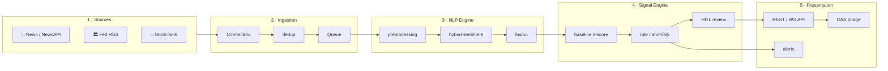
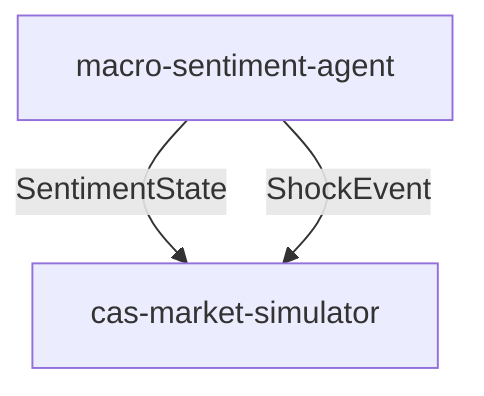

<div align="center">

# 📊 Macro-Sentiment Agent

### Financial news · Fed · social media → NLP → **market sentiment signals**

An autonomous analysis agent that reads text streams in real time and produces **actionable sentiment signals**.
It generates decision support — **it does not trade, and it does not give investment advice.**

<br>

**🌐 Language:** English · [Türkçe](README.md)

<br>

[](https://github.com/7mertyavuz/macro-sentiment-agent/actions/workflows/ci.yml)


</div>

---

## 🎯 What does it do?

The information that moves markets shows up **as text before it shows up in price data**: news headlines, Fed minutes, corporate disclosures, social media feeds. This agent reads that text continuously, analyzes it with NLP, and produces signals like:

```text
⚑ [panic   ] BTC — extreme fear: negative news density rose in the last hour
⚑ [euphoria] NVDA — social media euphoria peaking; possible top signal
⚑ [fed_tone] FED — hawkish tone strengthening; sentiment -0.62
```

Every signal carries **direction · intensity (0–100) · confidence score · source distribution · timestamp**.

---

## 🏗️ Architecture

Event-driven, loosely coupled **5 layers**:



---

## 📦 Key Features

| Feature | Description |
|---|---|
| 🧠 **Hybrid NLP** | FinBERT (local) + LLM (nuance) + lexicon fallback |
| 📡 **Multi-source** | RSS · NewsAPI · Fed · StockTwits; silently skipped when no key |
| 🔗 **CAS bridge** | `SentimentState` + `ShockEvent` contracts |
| 🚨 **Anomaly signals** | Persistent baseline (Welford) + cooldown |
| 👤 **HITL** | High-impact signals wait for approval |
| 🔭 **Observability** | `/metrics`, structured logs, CI, Docker Compose |

---

## ⚡ Quick Start

```bash
python -m venv .venv
pip install -e ".[dev]"
cp .env.example .env

# Offline demo
USE_FINBERT=false python -m macro_sentiment.cli demo --sample tests/fixtures/sample_feed.xml

# REST API
uvicorn macro_sentiment.api.main:app --reload
```

---

## 🔗 cas-market-simulator Integration

Within the CAS plan, this repo plays two roles:

- **Sentiment sensor** → `SentimentState` (polarity, emotion, fed_tone)
- **Exogenous shock injector** → `ShockEvent` (panic, euphoria, fed_tone)



---

## ⚖️ Disclaimer

The signals produced are for informational purposes and **are not investment advice.** The system generates decision support; it does not send automated orders.

## 📄 License

MIT — see [LICENSE](LICENSE).
