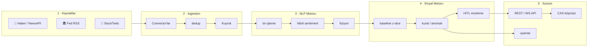
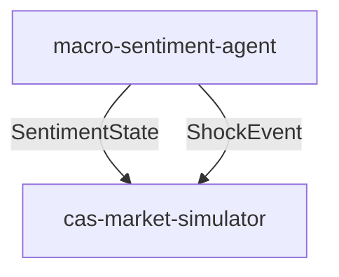

<div align="center">

# 📊 Macro-Sentiment Agent

### Finansal haber · Fed · sosyal medya → NLP → **piyasa duyarlılığı sinyalleri**

Metin akışını gerçek zamanlı okuyup **işlenebilir duyarlılık sinyalleri** üreten otonom analiz ajanı.
Karar destek üretir — **işlem yapmaz, yatırım tavsiyesi vermez.**

<br>

[](https://github.com/7mertyavuz/macro-sentiment-agent/actions/workflows/ci.yml)


</div>

---

## 🎯 Ne işe yarar?

Piyasayı hareket ettiren bilgi, fiyat verisinden **önce metin olarak** ortaya çıkar: haber başlıkları, Fed tutanakları, şirket açıklamaları, sosyal medya akışları. Bu ajan metni sürekli okur, NLP ile analiz eder ve şu tip sinyalleri üretir:

```text
⚑ [panic   ] BTC — aşırı korku: son 1 saatte negatif haber yoğunluğu arttı
⚑ [euphoria] NVDA — sosyal medya coşkusu zirvede; olası tepe sinyali
⚑ [fed_tone] FED — hawkish tonu güçleniyor; duyarlılık -0.62
```

Her sinyal **yön · şiddet (0–100) · güven skoru · kaynak dağılımı · zaman damgası** taşır.

---

## 🏗️ Mimari

Olay güdümlü, gevşek bağlı **5 katman**:



---

## 📦 Başlıca Özellikler

| Özellik | Açıklama |
|---|---|
| 🧠 **Hibrit NLP** | FinBERT (yerel) + LLM (nüans) + sözlük fallback |
| 📡 **Çoklu kaynak** | RSS · NewsAPI · Fed · StockTwits; anahtar yoksa sessizce atlanır |
| 🔗 **CAS köprüsü** | `SentimentState` + `ShockEvent` sözleşmeleri |
| 🚨 **Anomali sinyalleri** | Kalıcı baseline (Welford) + cooldown |
| 👤 **HITL** | Yüksek-etki sinyalleri onay bekler |
| 🔭 **Gözlemlenebilirlik** | `/metrics`, yapılandırılmış log, CI, Docker Compose |

---

## ⚡ Hızlı Başlangıç

```bash
python -m venv .venv
pip install -e ".[dev]"
cp .env.example .env

# Çevrimdışı demo
USE_FINBERT=false python -m macro_sentiment.cli demo --sample tests/fixtures/sample_feed.xml

# REST API
uvicorn macro_sentiment.api.main:app --reload
```

---

## 🔗 cas-market-simulator Entegrasyonu

Bu repo, CAS planında iki rol üstlenir:

- **Sentiment sensörü** → `SentimentState` (polarity, emotion, fed_tone)
- **Dışsal şok enjektörü** → `ShockEvent` (panic, euphoria, fed_tone)



---

## ⚖️ Sorumluluk Reddi

Üretilen sinyaller bilgilendirme amaçlıdır ve **yatırım tavsiyesi değildir.** Sistem karar destek üretir; otomatik emir göndermez.

## 📄 Lisans

MIT — bkz. [LICENSE](LICENSE).
