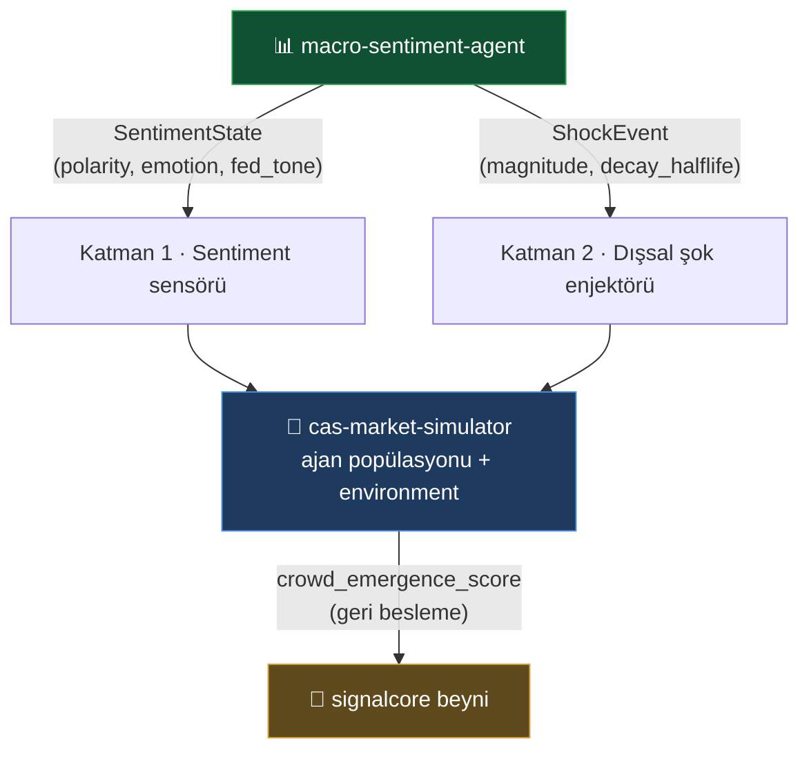
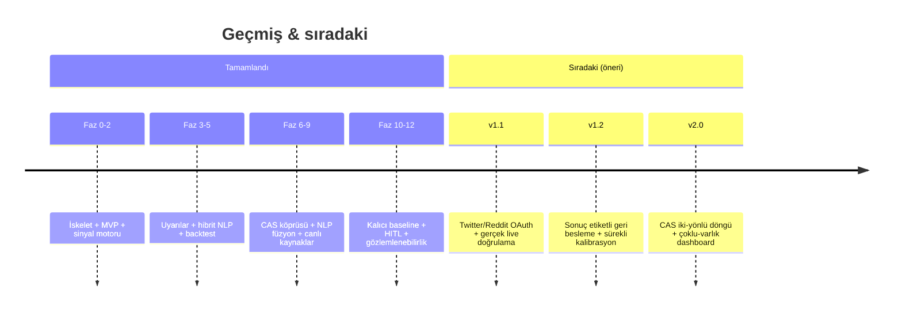

<div align="center">

# 📊 Macro-Sentiment Agent

### Finansal haber · Fed · sosyal medya → NLP → **piyasa duyarlılığı sinyalleri**

Metin akışını gerçek zamanlı okuyup **işlenebilir duyarlılık sinyalleri** üreten otonom analiz ajanı.
Karar destek üretir — **işlem yapmaz, yatırım tavsiyesi vermez.**

<br>

[](https://github.com/7mertyavuz/macro-sentiment-agent/actions/workflows/ci.yml)


</div>

---

## 🎯 Ne işe yarar?

Piyasayı hareket ettiren bilgi, fiyat verisinden **önce metin olarak** ortaya çıkar: haber başlıkları, Fed tutanakları, şirket açıklamaları, sosyal medya akışları. İnsan bu akışı gerçek zamanlı takip edemez. Bu ajan metni sürekli okur, NLP ile analiz eder ve şu tip sinyalleri üretir:

```text
⚑ [panic   ] BTC — aşırı korku: son 1 saatte negatif haber yoğunluğu arttı, panik satışı riski
⚑ [euphoria] NVDA — sosyal medya coşkusu zirvede; olası tepe / geri çekilme sinyali
⚑ [fed_tone] FED — hawkish (şahin) tonu güçleniyor; tutanak duyarlılığı -0.62 (önceki -0.18)
```

Her sinyal **yön · şiddet (0–100) · güven skoru · kaynak dağılımı · zaman damgası** taşır.

<br>

<table>
<tr>
<td width="33%" valign="top">

### 🧠 Hibrit NLP
FinBERT (yerel, hızlı) + LLM (nüanslı, hawkish/dovish) + sözlük fallback. Router maliyeti kontrol eder; torch yoksa bile çalışır.

</td>
<td width="33%" valign="top">

### 📡 Çoklu canlı kaynak
RSS · NewsAPI · Fed press RSS · StockTwits. Anahtar yoksa kaynak **sessizce atlanır** — sistem hiç bozulmaz.

</td>
<td width="33%" valign="top">

### 🔗 CAS köprüsü
`SentimentState` + `ShockEvent` sözleşmeleriyle `cas-market-simulator`'a gevşek bağlı; deterministik senaryo replay'i.

</td>
</tr>
<tr>
<td valign="top">

### 🚨 Anomali sinyalleri
Baseline z-skoru (kalıcı Welford) + cooldown. Panic / euphoria / fed_tone — eşikler backtest ile kalibre.

</td>
<td valign="top">

### 👤 İnsan döngüde (HITL)
Yüksek-etki sinyaller **onay bekler**, otomatik dağıtılmaz. Onay/ret geri beslemesi kalıcı saklanır.

</td>
<td valign="top">

### 🔭 Üretime hazır
`/metrics` (Prometheus), yapılandırılmış log, CI (pytest+ruff+mypy+pip-audit), Docker Compose, RUNBOOK.

</td>
</tr>
</table>

---

## 🏗️ Mimari

Olay güdümlü (event-driven), gevşek bağlı **5 katman**. Her katman mesaj kuyruğu üzerinden konuşur; bir kaynak çökse sistem ayakta kalır.

```mermaid
flowchart LR
    subgraph SRC["1 · Kaynaklar"]
        direction TB
        N["📰 Haber / NewsAPI"]
        F["🏛️ Fed RSS"]
        S["💬 StockTwits"]
    end
    subgraph ING["2 · Ingestion"]
        direction TB
        C["Connector'lar<br/>+ retry"]
        D["dedup"]
        Q["(Kuyruk<br/>memory / redis)"]
    end
    subgraph NLP["3 · NLP Motoru"]
        direction TB
        PRE["ön işleme<br/>+ spam filtre"]
        ENT["NER-lite"]
        SENT["hibrit sentiment<br/>FinBERT ↔ LLM"]
        FUSE["füzyon"]
    end
    subgraph SIG["4 · Sinyal Motoru"]
        direction TB
        BASE["baseline<br/>z-skor (Welford)"]
        RULE["kural / anomali"]
        REV["HITL inceleme"]
    end
    subgraph OUT["5 · Sunum"]
        direction TB
        API["REST / WS API"]
        ALERT["uyarılar<br/>Slack · Telegram"]
        DASH["dashboard"]
        CAS["CAS köprüsü"]
    end

    SRC --> C --> D --> Q --> PRE --> ENT --> SENT --> FUSE --> BASE --> RULE --> REV --> API
    RULE --> ALERT
    API --> DASH
    REV --> CAS

    style SRC fill:#1e3a5f,stroke:#4a90d9,color:#fff
    style ING fill:#3d2c5f,stroke:#8b5cf6,color:#fff
    style NLP fill:#0f5132,stroke:#2ea44f,color:#fff
    style SIG fill:#5f2c2c,stroke:#e05252,color:#fff
    style OUT fill:#5f4a1e,stroke:#d9a441,color:#fff
```



<details>
<summary><b>📁 Proje yapısı</b></summary>

```
src/macro_sentiment/
  core/          # veri modelleri, sözleşmeler (Protocol), config
  sources/       # Katman 1 — RSS · NewsAPI · Fed · StockTwits (gerçek); Twitter/Reddit (stub)
  ingestion/     # Katman 2 — collector, dedup, kuyruk (InMemory + Redis)
  nlp/           # Katman 3 — preprocess, NER-lite, FinBERT + LLM + sözlük fallback, füzyon
  signals/       # Katman 4 — aggregator, baseline, kural/anomali, review, kalibrasyon
  api/           # Katman 5 — FastAPI REST + WebSocket + CAS köprüsü (contracts/transport/scenario)
  storage/       # SQLAlchemy ORM + repository (SQLite dev / Postgres üretim)
  observability/ # /metrics (Prometheus) + yapılandırılmış log
  worker/        # boru hattı döngüleri, connector polling
  cli.py         # komut satırı arayüzü
tests/           # 21 dosya · 151 test — birim + uçtan uca (+ fixtures)
docs/            # ARCHITECTURE.md · CAS-ROADMAP.md · RUNBOOK.md
```
</details>

---

## ⚡ Hızlı başlangıç

```bash
# 1) Kurulum
python -m venv .venv && source .venv/bin/activate
pip install -e ".[dev]"        # temel + test
pip install -e ".[nlp]"        # FinBERT için (transformers + torch) — opsiyonel
cp .env.example .env

# 2) Çevrimdışı demo (ağ/torch gerekmez — sözlük fallback):
USE_FINBERT=false python -m macro_sentiment.cli demo --sample tests/fixtures/sample_feed.xml

# 3) REST API + canlı dashboard:
uvicorn macro_sentiment.api.main:app --reload   # → http://localhost:8000
```

<details>
<summary><b>Diğer CLI komutları</b></summary>

```bash
python -m macro_sentiment.cli scores  --entity AAPL              # üretilen skorlar
python -m macro_sentiment.cli signals                            # üretilen sinyaller
python -m macro_sentiment.cli backtest --dataset tests/fixtures/backtest.jsonl --verbose
python -m macro_sentiment.cli run --hours 24                     # canlı kaynaklardan uçtan uca
python -m macro_sentiment.cli feed  --entities FED BTC AAPL      # CAS SentimentState çıktısı
python -m macro_sentiment.cli replay --scenario tests/fixtures/scenario.jsonl --step 300
```

**API uçları:** `GET /` (dashboard) · `/health` · `/metrics` · `/v1/sentiment/{entity}` · `/v1/signals` · `/v1/review/*` · `/v1/cas/sentiment/{entity}` · `/v1/cas/shocks`
</details>

---

## 📶 Sinyal tipleri & NLP modları

<table>
<tr><td valign="top" width="50%">

**Sinyal tipleri** *(anomali-tabanlı, cooldown'lı)*

| Tip | Tetikleyici |
|---|---|
| `panic` | negatif polarite + yüksek korku |
| `euphoria` | yüksek pozitif + açgözlülük |
| `fed_tone` | FED ton kayması (hawkish/dovish) |

</td><td valign="top" width="50%">

**NLP modları** *(`NLP_MODE`)*

| Mod | Davranış |
|---|---|
| `finbert` | Yerel FinBERT/sözlük — hızlı, ucuz (varsayılan) |
| `llm` | Anthropic LLM — nüanslı, `LLM_API_KEY` gerekir |
| `hybrid` | Router: rutin→FinBERT, Fed/yüksek-etki→LLM |

</td></tr>
</table>

---

## 🔗 cas-market-simulator entegrasyonu

Bu repo, hibrit **CAS (Complex Adaptive System)** planında iki rol üstlenir ve simülatöre **yalnızca veri tipleriyle** bağlanır (kod bağımlılığı yok):



- **Katman 1 — Sentiment sensörü:** `SentimentFeed.latest(entity)` → sözleşmedeki `SentimentState`. Ham/temiz duyarlılık verir; **ağırlık kararını tüketen motora bırakır** (çift sayım engeli).
- **Katman 2 — Dışsal şok enjektörü:** `SentimentFeed.shocks(since)` → simülasyona enjekte edilebilir `ShockEvent` (panik 30 dk, fed_tone 4 saat üssel sönüm).
- **Taşıma katmanı:** `to_dict`/`from_dict` + `schema_version`, async `stream()` push API, `/v1/cas/*` HTTP uçları — simülatör ayrı süreç/repo olarak tüketebilir.

| Mod | Davranış |
|---|---|
| `offline` (varsayılan) | Harici API/anahtar yok. Senaryo → deterministik replay; senaryosuz → varlık adından türetilen sentetik durum. |
| `live` | DB'deki gerçek skor/sinyalleri okur, pencere toplar, sözleşme tiplerine çevirir. |

<details>
<summary><b>Senaryo replay örneği (programatik)</b></summary>

```python
from macro_sentiment.api.scenario import ScenarioPlayer
from macro_sentiment.api.sentiment_feed import SentimentFeed

player = ScenarioPlayer.from_jsonl("tests/fixtures/scenario.jsonl")
feed = SentimentFeed(mode="offline", scenario=player)
feed.advance(600)
state  = feed.latest("AAPL")           # -> SentimentState
shocks = feed.shocks(player.start_ts)  # -> list[ShockEvent]
```
</details>

---

## 🗺️ Yol haritası

Faz 0–12 **tamamlandı** (skeleton → MVP → sinyal motoru → uyarılar → hibrit NLP → backtest → CAS köprüsü → NLP kalitesi → canlı kaynaklar → kalıcı baseline → HITL → gözlemlenebilirlik).



**Önerilen sonraki adımlar:** Twitter/Reddit resmi connector'ları (şu an stub), `live` modun gerçek veriyle doğrulanması, HITL geri beslemesinin piyasa-sonucu etiketiyle zenginleştirilip backtest setine akıtılması, ve `cas-market-simulator`'ın `SimSentimentFeed`'inin bu reponun gerçek `offline` moduna bağlanması (şu an simülatör tarafında yer tutucu).

<details>
<summary><b>Faz tarihçesi (tam liste)</b></summary>

| Faz | İçerik |
|---|---|
| 0 | İskelet + arayüz sözleşmeleri |
| 1 | RSS → NLP (FinBERT/fallback) → DB uçtan uca boru hattı |
| 2 | Sinyal motoru (panic/euphoria/fed-tone, baseline z-skor, cooldown) |
| 3 | Uyarı kanalları (webhook/Slack/Telegram) + canlı dashboard |
| 4 | Hibrit NLP: router (FinBERT↔LLM) + LLM hawkish/dovish |
| 5 | Backtest harness (precision/recall/F1, eşik kalibrasyonu) |
| 6 | CAS köprüsü sağlamlaştırma: serileştirme, şok sönümleme, `stream()`, `/v1/cas/*` |
| 7 | NLP kalitesi: skor füzyonu, gerçek `emotion.uncertainty`, olumsuzlama/sarkazm-lite |
| 8 | Canlı kaynaklar I: NewsAPI + Fed press RSS |
| 9 | Canlı kaynaklar II: StockTwits + bot/spam sezgileri |
| 10 | Kalıcı taban çizgisi: `BaselineRepository` (Welford rolling mean/std) |
| 11 | HITL inceleme kuyruğu + otomatik eşik kalibrasyonu |
| 12 | Gözlemlenebilirlik (`/metrics`, log), CI, Docker Compose, RUNBOOK |

Tam tarihçe ve tasarım gerekçeleri: [`docs/CAS-ROADMAP.md`](./docs/CAS-ROADMAP.md) · Operasyon: [`docs/RUNBOOK.md`](./docs/RUNBOOK.md)
</details>

---

## ⚙️ Yapılandırma (`.env`)

| Değişken | Varsayılan | Açıklama |
|---|---|---|
| `DATABASE_URL` | `sqlite+aiosqlite:///./macro_sentiment.db` | Dev SQLite; üretimde `postgresql+asyncpg://…` |
| `QUEUE_BACKEND` | `memory` | `memory` (dev) veya `redis` (üretim) |
| `NLP_MODE` | `finbert` | `finbert` · `llm` · `hybrid` |
| `USE_FINBERT` | `true` | `false` → sözlük fallback (torch gerekmez) |
| `NEWSAPI_KEY` / `FRED_API_KEY` | — | Varsa NewsAPI/Fed connector otomatik etkinleşir |
| `STOCKTWITS_ENABLED` | `false` | Açık onayla sosyal kaynak |
| `ALERT_MIN_SEVERITY` | — | Bu eşiği geçen sinyaller kanallara gönderilir |

---

## 🧪 Test & CI

```bash
pip install -e ".[dev]"
pytest -q          # 151 test: RSS parse, NLP/füzyon, storage, CAS köprüsü, uçtan uca pipeline
```

CI (`.github/workflows/ci.yml`): `pytest` (py3.11/3.12 matris + coverage) · `ruff check` (engelleyici) · `ruff format` + `mypy` + `pip-audit` (rapor) · gizli-anahtar taraması.

> ℹ️ SQLite bazı ağ/sanal dosya sistemlerinde `disk I/O error` verebilir; `DATABASE_URL`'i yerel diske (örn. `/tmp/...`) veya Postgres'e yönlendirin.

---

## 📌 Sorumluluk reddi

Üretilen sinyaller **bilgilendirme amaçlıdır ve yatırım tavsiyesi değildir.** Sistem karar destek üretir; otomatik emir göndermez / işlem yürütmez.

## 📄 Lisans

[MIT](./LICENSE) — © 2026 hasan mert yavuz
