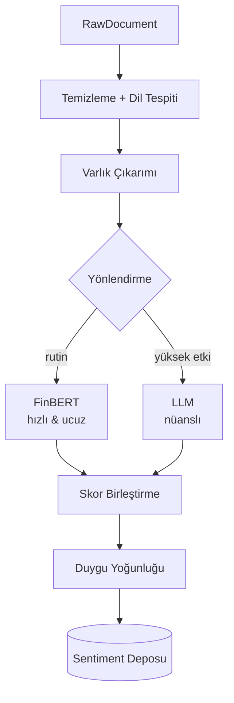
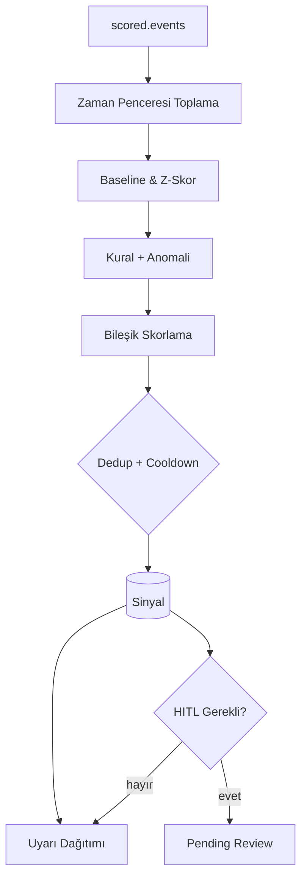
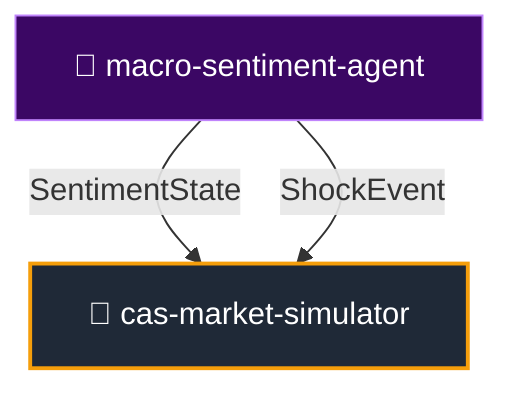

<div align="center">

# 📊 Macro-Sentiment Agent

### Finansal haber · Fed · sosyal medya → NLP → **piyasa duyarlılığı sinyalleri**

Metin akışını gerçek zamanlı okuyup **işlenebilir duyarlılık sinyalleri** üreten otonom analiz ajanı.  
Karar destek üretir — **işlem yapmaz, yatırım tavsiyesi vermez.**

<br>

[](https://github.com/7mertyavuz/macro-sentiment-agent/actions/workflows/ci.yml)


</div>

---

> ⚠️ **Araştırma / PoC — yatırım tavsiyesi değildir.**  
> Üretilen sinyaller bilgilendirme amaçlıdır; otomatik emir gönderilmez.

---

## 📌 İçindekiler

- [Proje Özeti](#-proje-özeti)
- [Neden Önemli?](#-neden-önemli)
- [Mimari Genel Bakış](#-mimari-genel-bakış)
- [Başlıca Özellikler](#-başlıca-özellikler)
- [Hızlı Başlangıç](#-hızlı-başlangıç)
- [Modül / Katman Rehberi](#-modül--katman-rehberi)
- [Veri Modelleri](#-veri-modelleri)
- [NLP Motoru](#-nlp-motoru)
- [Sinyal Motoru](#-sinyal-motoru)
- [CAS Ekosistemindeki Yeri](#-cas-ekosistemindeki-yeri)
- [Dağıtım](#-dağıtım)
- [Gözlemlenebilirlik](#-gözlemlenebilirlik)
- [Testler](#-testler)
- [Sözlük](#-sözlük)
- [Sorumluluk Reddi ve Lisans](#-sorumluluk-reddi-ve-lisans)

---

## 🎯 Proje Özeti

Piyasayı hareket ettiren bilgi, fiyat verisinden **önce metin olarak** ortaya çıkar: haber başlıkları, Fed tutanakları, şirket açıklamaları, sosyal medya akışları. `macro-sentiment-agent`, bu metin akışını sürekli okuyan, doğal dil işleme (NLP) ile analiz eden ve **erken uyarı sinyalleri** üreten otonom bir ajan sistemidir.

Sistem şu tip sinyaller üretir:

```text
⚑ [panic   ] BTC — aşırı korku: son 1 saatte negatif haber yoğunluğu arttı
⚑ [euphoria] NVDA — sosyal medya coşkusu zirvede; olası tepe sinyali
⚑ [fed_tone] FED — hawkish tonu güçleniyor; duyarlılık -0.62
```

Her sinyal şunları taşır:

- **Yön** (olumlu / olumsuz / nötr)
- **Şiddet** (0–100)
- **Güven skoru** (0–1)
- **Kaynak dağılımı** (haber / sosyal / Fed)
- **Zaman damgası** (UTC, tz-aware)

---

## 💡 Neden Önemli?

| Problem | Çözüm |
|---|---|
| İnsan, binlerce haber başlığını takip edemez. | Asenkron, ölçeklenebilir toplama motoru. |
| Aynı haber farklı kaynaklarda tekrarlanır. | Hash + vektör benzerliği ile deduplikasyon. |
| LLM maliyetleri hızlı artabilir. | Hibrit NLP router: rutin metinler FinBERT'e, yüksek-etki metinler LLM'e gider. |
| Yanlış pozitif sinyaller | Baseline z-skor + cooldown + HITL inceleme kuyruğu. |
| Üretim ölçeği | Bellek-içi MVP'den Redis Streams / Kafka / Postgres'e geçiş yolu. |

---

## 🏗️ Mimari Genel Bakış

Sistem, olay güdümlü ve gevşek bağlı **5 katman**dan oluşur:

```mermaid
flowchart LR
    subgraph SRC["1 · Kaynaklar"]
        N["📰 Haber / NewsAPI"]
        F["🏛️ Fed / FRED / FOMC"]
        S["💬 StockTwits / X / Reddit"]
    end

    subgraph ING["2 · Ingestion"]
        C["Connector'lar"]
        D["Dedup"]
        Q["Kuyruk"]
    end

    subgraph NLP["3 · NLP Motoru"]
        PRE["Ön İşleme"]
        ENT["Varlık Çıkarımı"]
        SENT["Hibrit Sentiment"]
        FUSE["Füzyon"]
    end

    subgraph SIG["4 · Sinyal Motoru"]
        BASE["Baseline & Z-Skor"]
        RULE["Kural / Anomali"]
        REV["HITL İnceleme"]
    end

    subgraph OUT["5 · Sunum"]
        API["REST / WS API"]
        ALERT["Uyarılar"]
        CAS["CAS Köprüsü"]
    end

    SRC --> C --> D --> Q --> PRE --> ENT --> SENT --> FUSE --> BASE --> RULE --> REV --> API
    RULE --> ALERT
    API --> CAS
```



### 🧩 Katmanların İşleyişi

| Katman | Görevi | Girdi | Çıktı |
|---|---|---|---|
| **1. Kaynaklar** | RSS, NewsAPI, Fed, sosyal medya bağlantıları | API / RSS akışları | `RawDocument` |
| **2. Ingestion** | Normalize et, tekrarları ele, kuyruğa al | `RawDocument` | Kuyruk mesajları |
| **3. NLP** | Temizle, varlık çıkar, duyarlılık skoru üret | `RawDocument` | `SentimentScore` |
| **4. Sinyal** | Zaman penceresi topla, anomali tespiti, cooldown | `SentimentScore` listesi | `Signal` |
| **5. Sunum** | REST/WebSocket API, uyarılar, CAS köprüsü | `Signal` | JSON / WebSocket / Alert |

---

## 📦 Başlıca Özellikler

| Özellik | Açıklama |
|---|---|
| 🧠 **Hibrit NLP** | FinBERT (yerel) + LLM (nüans) + sözlük fallback |
| 📡 **Çoklu kaynak** | RSS · NewsAPI · Fed · StockTwits; anahtar yoksa sessizce atlanır |
| 🔗 **CAS köprüsü** | `SentimentState` + `ShockEvent` sözleşmeleri |
| 🚨 **Anomali sinyalleri** | Kalıcı baseline (Welford) + cooldown |
| 👤 **HITL** | Yüksek-etki sinyalleri onay bekler |
| 🔭 **Gözlemlenebilirlik** | `/metrics`, yapılandırılmış log, CI, Docker Compose |
| 🧪 **Simülasyon modu** | Anahtarsız, deterministik offline demo |
| 🐳 **Konteyner desteği** | Dockerfile + docker-compose.yml (Postgres + Redis) |

---

## ⚡ Hızlı Başlangıç

### 1. Kurulum

```bash
# Repoyu klonla
git clone https://github.com/7mertyavuz/macro-sentiment-agent.git
cd macro-sentiment-agent

# Sanal ortam (önerilir)
python -m venv .venv
source .venv/bin/activate  # Windows: .venv\Scripts\activate

# Geliştirici kurulumu
pip install -e ".[dev]"

# NLP ekstraları (FinBERT + spaCy) için
pip install -e ".[nlp]"
```

### 2. Ortam Değişkenleri

```bash
cp .env.example .env
```

`.env` dosyasındaki değerleri doldurun. Sadece temel RSS ile çalışmak için hiçbir anahtar gerekmez.

### 3. Çalıştırma

```bash
# Çevrimdışı demo — hiçbir API anahtarı gerekmez
USE_FINBERT=false python -m macro_sentiment.cli demo --sample tests/fixtures/sample_feed.xml

# REST API
uvicorn macro_sentiment.api.main:app --reload

# Worker (belirli bir saatlik pencereyi işle)
python -m macro_sentiment.cli run --hours 1
```

### 4. Docker ile Çalıştırma

```bash
# Postgres + Redis + API + Worker
export NEWSAPI_KEY=your_key
export FRED_API_KEY=your_key
docker compose up -d

# Sağlık kontrolü
curl -sf http://localhost:8000/health
```

---

## 📚 Modül / Katman Rehberi

### `src/macro_sentiment/sources/` — Veri Kaynakları

- **`base.py`**: Tüm connector'ların uyguladığı `SourceConnector` Protocol'ü.
- **`rss_connector.py`**: RSS/Atom feed'lerini çeker.
- **`newsapi_connector.py`**: NewsAPI entegrasyonu (anahtar gerekir).
- **`fed_connector.py`**: FRED / FOMC / Fed basın açıklamaları.
- **`social_connector.py`**: StockTwits / X / Reddit (anahtar gerekir).
- **`registry.py`**: Kaynakları kaydetme ve devre dışı bırakma merkezi.

### `src/macro_sentiment/ingestion/` — Veri Toplama

- **`collector.py`**: Connector'ları periyodik olarak çeker.
- **`normalizer.py`**: Her kaynağı `RawDocument` şemasına normalize eder.
- **`dedup.py`**: İçerik hash'i + vektör benzerliği ile tekrarları eler.
- **`queue.py`**: Bellek-içi veya Redis Streams mesaj kuyruğu.

### `src/macro_sentiment/nlp/` — NLP Motoru

| Modül | Görev |
|---|---|
| `preprocess.py` | HTML/emoji/URL temizliği, dil tespiti |
| `ner.py` | Varlık ve ticker çıkarımı |
| `sentiment_finbert.py` | Yerel FinBERT duyarlılık skoru |
| `sentiment_llm.py` | LLM tabanlı nüanslı analiz |
| `router.py` | Metni FinBERT veya LLM'e yönlendirir |
| `hybrid.py` | Hibrit model: maliyet kontrollü füzyon |
| `fusion.py` | Çoklu model çıktısını birleştirir |
| `llm_provider.py` | Anthropic / OpenAI sağlayıcı soyutlaması |
| `lexicon_fallback.py` | Sözlük tabanlı yedek skorlama |
| `spam_filter.py` | Bot ve spam filtreleme |

### `src/macro_sentiment/signals/` — Sinyal Motoru

- **`aggregator.py`**: Varlık × zaman penceresi bazında skorları birleştirir.
- **`baseline.py`**: Welford algoritması ile kalıcı rolling baseline.
- **`rules.py`**: Panik, öfori, Fed tonu, anlatı değişimi kuralları.
- **`scorer.py`**: Cooldown ve sinyal şiddeti hesabı.
- **`engine.py`**: Sinyal motoru orkestrasyonu.
- **`review.py`**: HITL inceleme kuyruğu mantığı.
- **`calibration.py`**: Backtest ve otomatik eşik kalibrasyonu.

### `src/macro_sentiment/api/` — Sunum Katmanı

- **`main.py`**: FastAPI uygulama giriş noktası.
- **`routes.py`**: REST uç noktaları (`/v1/signals`, `/v1/sentiment`, `/v1/cas/*`).
- **`sentiment_feed.py`**: `SentimentFeed` CAS adaptörü.
- **`cas_transport.py`**: `SentimentState` / `ShockEvent` serileştirme.
- **`cas_contracts.py`**: CAS veri sözleşmeleri.
- **`websocket.py`**: Gerçek zamanlı sinyal akışı.
- **`dashboard.py`**: Gömülü HTML dashboard.
- **`alerts.py`**: Slack / Telegram / webhook uyarıları.
- **`scenario.py`**: Deterministik şok senaryoları.

### `src/macro_sentiment/storage/` — Kalıcılık

- **`db.py`**: Async SQLAlchemy bağlantı yönetimi.
- **`orm.py`**: Veritabanı tablo tanımları.
- **`repositories.py`**: CRUD işlemleri.

### `src/macro_sentiment/backtest/` — Değerlendirme

- **`dataset.py`**: Etiketli veri setleri.
- **`harness.py`**: Backtest koşum takımı.
- **`metrics.py`**: F1, precision, recall, vb.

### `src/macro_sentiment/observability/` — Gözlemlenebilirlik

- **`logging.py`**: Yapılandırılmış JSON loglama.
- **`metrics.py`**: Prometheus metrikleri.

### `src/macro_sentiment/worker/` — Arka Plan Görevleri

- **`tasks.py`**: Zamanlanmış toplama ve işleme görevleri.

---

## 🧾 Veri Modelleri

Sistem, katmanlar arasında standart Pydantic modelleri kullanır:

### `RawDocument`

Bir kaynaktan çekilen normalize edilmiş ham metin belgesi.

| Alan | Açıklama |
|---|---|
| `id` | Kaynak-içi benzersiz kimlik |
| `source` | Connector source_id |
| `source_type` | NEWS / FED / SOCIAL / MARKET |
| `title` | Başlık (varsa) |
| `body` | Metin içeriği |
| `published_at` | Yayınlanma zamanı |
| `content_hash` | Dedup için içerik hash'i |

### `SentimentScore`

Bir belge + varlık çifti için duyarlılık skoru.

| Alan | Aralık | Anlamı |
|---|---|---|
| `polarity` | `[-1, 1]` | Genel duyarlılık |
| `intensity` | `[0, 100]` | Duygu şiddeti |
| `emotion.fear` | `[0, 1]` | Korku yoğunluğu |
| `emotion.greed` | `[0, 1]` | Açgözlülük / coşku yoğunluğu |
| `emotion.uncertainty` | `[0, 1]` | Belirsizlik yoğunluğu |
| `confidence` | `[0, 1]` | Model güveni |
| `source_type` | enum | Hangi kaynak türünden geldiği |

### `Signal`

Sinyal motorunun ürettiği eyleme dönük uyarı.

| Alan | Açıklama |
|---|---|
| `type` | panic / euphoria / fed_tone / narrative / breakout |
| `severity` | 0–100 şiddet |
| `direction` | -1 (olumsuz) … +1 (olumlu) |
| `headline` | İnsan-okunur özet |
| `review_status` | pending / approved / rejected (HITL) |

### `SentimentState` — CAS Çıktı Sözleşmesi

```python
SentimentState(
    entity="BTC",
    polarity=-0.71,
    intensity=88.0,
    emotion={"fear": 0.82, "greed": 0.05, "uncertainty": 0.41},
    confidence=0.79,
    fed_tone=None,
    source_breakdown={"news": -0.6, "social": -0.85, "fed": None},
    ts=datetime.now(timezone.utc),
)
```

### `ShockEvent` — Dışsal Şok Sözleşmesi

CAS simülatörüne enjekte edilen dışsal olay.

```python
ShockEvent(
    kind="panic",
    entity="BTC",
    magnitude=0.85,
    decay_halflife_s=300.0,
    ts=datetime.now(timezone.utc),
)
```

---

## 🧠 NLP Motoru

Hibrit NLP, maliyet ve doğruluk arasında denge kurar:



### Yönlendirme Kriterleri

- **FinBERT**: Kısa haber başlıkları, yüksek hacimli rutin akış.
- **LLM**: Uzun Fed tutanakları, kazanç çağrıları, yüksek etkili olaylar.
- **Füzyon**: İki model çeliştiğinde güveni düşürür; aynı yönde güçlendirdiğinde artırır.

---

## 🚨 Sinyal Motoru

Skorlanmış olaylar tek başına gürültülüdür. Sinyal motoru bunları az sayıda, eyleme dönük uyarıya damıtır.



### Sinyal Tipleri

| Tip | Tetikleyici | Örnek |
|---|---|---|
| **panic** | Negatif + yüksek korku + hacim patlaması | "Aşırı korku — panik satışı riski" |
| **euphoria** | Aşırı pozitif + greed zirvesi | "Euphoria — olası tepe/geri çekilme" |
| **fed_tone** | Tutanak hawkish/dovish kayması | "Hawkish ton güçleniyor" |
| **narrative** | Konu/temada ani sapma | "NVDA anlatısı negatife döndü" |
| **breakout** | Uzun nötr sonrası ani aktivite | "Olağandışı haber aktivitesi" |

---

## 🌐 CAS Ekosistemindeki Yeri

Bu repo, CAS planında iki rol üstlenir:

- **Sentiment sensörü** → `SentimentState`
- **Dışsal şok enjektörü** → `ShockEvent`



Sözleşmeler gevşek bağlıdır; `cas-market-simulator` yalnızca `SentimentState` ve `ShockEvent` tiplerine bağımlıdır.

---

## 🐳 Dağıtım

### Docker Compose

```bash
# Servisleri başlat
docker compose up -d db redis

# Veritabanını başlat
docker compose run --rm api python -c \
  "import asyncio; from macro_sentiment.storage.db import init_db; asyncio.run(init_db())"

# API ve worker'ı başlat
docker compose up -d api worker

# Sağlık kontrolü
curl -sf http://localhost:8000/health
curl -sf http://localhost:8000/metrics | head -5
```

### Dağıtım Öncesi Kontrol Listesi

- [ ] `pytest -q` yeşil
- [ ] `ruff check src tests` temiz
- [ ] `python scripts/check_secrets.py` temiz
- [ ] `.env` üretim değerleriyle dolduruldu
- [ ] `DATABASE_URL` Postgres/TimescaleDB'ye işaret ediyor
- [ ] `QUEUE_BACKEND=redis` ayarlı
- [ ] `/health` ve `/metrics` erişilebilir

Detaylı runbook için bkz. [`docs/RUNBOOK.md`](docs/RUNBOOK.md).

---

## 🔭 Gözlemlenebilirlik

`GET /metrics` Prometheus formatında şu metrikleri sunar:

| Metrik | Açıklama |
|---|---|
| `msa_documents_fetched_total{source}` | Kaynak başına çekilen yeni belge |
| `msa_source_fetch_errors_total{source}` | Başarısız çekme turu |
| `msa_inference_seconds{model}` | Model çıkarım süresi |
| `msa_signals_emitted_total{type,review_status}` | Tip + inceleme durumu başına sinyal |
| `msa_queue_depth{topic}` | Kuyruk derinliği |

Loglar yapılandırılmış JSON olarak basılır ve istek boyunca `correlation_id` taşır.

---

## ✅ Testler

```bash
pytest -q
```

151'den fazla test şunları kapsar:

- Connector normalizasyonu
- Dedup mantığı
- FinBERT / LLM / hibrit skorlama
- Füzyon ve duygu çıkarımı
- Baseline ve z-skor
- Sinyal kuralları ve cooldown
- CAS transport serileştirme
- API uç noktaları
- HITL inceleme akışı

---

## 📖 Sözlük

| Terim | Açıklama |
|---|---|
| **Baseline** | Tarihsel normalin istatistiksel ölçüsü; z-skor için referans. |
| **Cooldown** | Aynı sinyalin tekrar tekrar atılmasını önleyen susturma mekanizması. |
| **Deduplikasyon** | Aynı veya çok benzer içeriğin birden fazla kez işlenmesini engelleme. |
| **Fed Tone** | FOMC tutanaklarının şahin (hawkish) veya güvercin (dovish) tonu. |
| **FOMC** | Federal Açık Piyasa Komitesi — ABD Merkez Bankası karar organı. |
| **FRED** | Federal Reserve Economic Data — St. Louis Fed veri API'si. |
| **FinBERT** | Finans metinlerine özel eğitilmiş BERT duyarlılık modeli. |
| **HITL** | Human-in-the-Loop — insanın kritik sinyalleri onayladığı döngü. |
| **LLM** | Large Language Model — büyük dil modeli (Claude, GPT vb.). |
| **Narrative** | Piyasa hakkında hakim olan anlatı / tema. |
| **NLP** | Natural Language Processing — doğal dil işleme. |
| **Polarity** | Metnin genel duyarlılık yönü (-1 negatif, +1 pozitif). |
| **Sentiment** | Duyarlılık; metnin olumlu/olumsuz tonu. |
| **ShockEvent** | Simülasyona dışsal etki olarak enjekte edilen ani olay. |
| **Source Breakdown** | Sinyalin haber, sosyal ve Fed kaynaklarına göre dağılımı. |
| **Welford** | Tek geçişli ortalama/varyans algoritması. |
| **Z-Skor** | Bir değerin tarihsel ortalamadan kaç standart sapma uzakta olduğu. |

---

## ⚖️ Sorumluluk Reddi ve Lisans

Üretilen sinyaller bilgilendirme amaçlıdır ve **yatırım tavsiyesi değildir.** Sistem karar destek üretir; otomatik emir göndermez.

**Lisans:** MIT — bkz. [LICENSE](LICENSE).

---

<div align="center">

**Built with FastAPI + Asyncio + FinBERT + LLM** · Hibrit NLP · HITL · CAS-Ready

</div>
